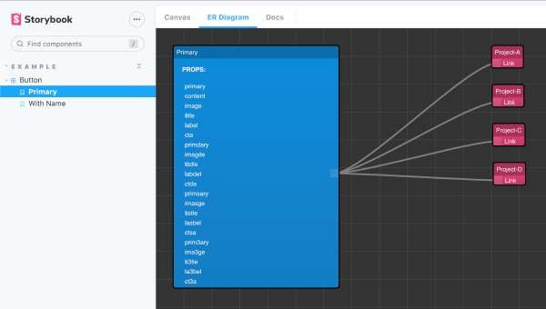

## storybook-er-diagram

A [Storybook](https://github.com/storybooks/storybook) addon useful when you have many projects built on top of a unique Design System.

<div align="center">
  
  <br/>
</div>

A component can behave in different ways and storybook stories describe them.
When your Design System is used by a lot of different projects we can lose sight of the whole picture.

Storybook ErDiagram manages links between component stories and projects that use them.

## Getting started

### 1. Install

```sh
npm install --save-dev storybook-er-diagram
# yarn add -D storybook-er-diagram
```

### 2. Register the addon in `main.js`

```js
module.exports = {
  addons: ["storybook-er-diagram"],
};
```

### 3. Add it to story!

add `erDiagramList` object to the story default export parameters and use the template name as key.
The name must be equal to the story template.

<div align="center">
  
  <br/>
</div>
</br>

### 4. Example

```js
export default {
  title: "Example/Button",
  component: Button,
  parameters: {
    erDiagramList: {
      Primary: ["Project-A", "Project-B", "Project-C", "Project-D"],
      ["Second Story"]: ["Project-B", "Project-C"],
      ["Another story"]: ["Project-A", "Project-D"],
    },
  },

const Template = (args) => <Button {...args} />;
export const Primary = Template.bind({});
export const secondStory = Template.bind({});
export const thirdStory = Template.bind({});
thirdStory.storyName = "Another story"
};
```
